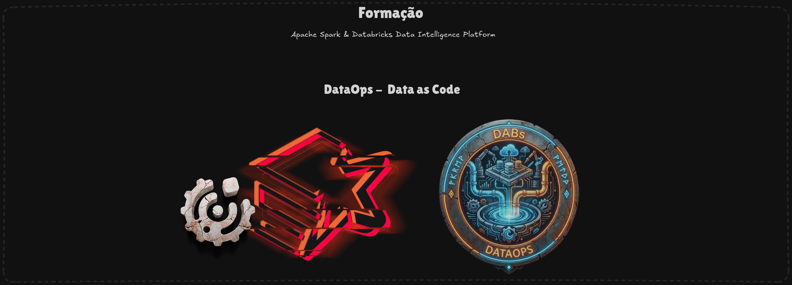

# Databricks Asset Bundles - Building Production-Ready Data Pipelines




## 🎯 Project Goal

Learn how to:
- Connect your local IDE to Databricks workspaces
- Create and deploy bundles using the official Databricks templates
- Build custom DLT pipelines with proper configuration separation
- Implement CI/CD automation with GitHub Actions
- Scale to multi-environment deployments (Dev → Prod)

```text
┌────────────────────────────────────────────────────────────────────────────┐
│                        LEARNING PROGRESSION                                │
│                                                                            │
│   00-Connection    01-First Bundle    02-Custom DLT    03-Multi-Env        │
│   ─────────────    ──────────────     ───────────────  ────────────        │
│   VS Code + CLI    bundle init        UberEats Data    Dev + Prod          │
│   Databricks       Template           Pipeline         CI/CD               │
│   Connect          Deploy             Single Env       Automated           │
│                                                                            │
│   [Foundation]  →  [Mechanics]    →   [Real Data]  →  [Production]         │
└────────────────────────────────────────────────────────────────────────────┘
```

---

## 📂 Project Structure

```text
dabs-realm/
├── databricks.yml                      # Root config for VS Code Extension (Connection Only)
│
├── 00-scripts-test-conn/               # Lesson 00: Connection Testing
│   └── Various connection test scripts
│
├── 01-bundle-databricks-exemple/       # Lesson 01: First Bundle (Template)
│   ├── databricks.yml                  # Bundle config from `bundle init`
│   ├── resources/                      # Pipeline & Job definitions
│   └── src/                            # Notebooks and Python code
│
├── 02-ubear-eats-bundle-01-env/        # Lesson 02: Custom DLT Pipeline (Single Env)
│   ├── databricks.yml                  # Custom bundle config
│   ├── config/variables.yml            # Externalized variables
│   ├── resources/pipelines/            # DLT pipeline definition
│   └── src/                            # Bronze → Silver → Gold code
│
├── 03-uber-eats-bundles-multi-env/     # Lesson 03: Multi-Environment + App
│   ├── databricks.yml                  # Multi-target config (dev/dev-cicd/prod)
│   ├── config/variables.yml            # Shared + override variables
│   ├── resources/
│   │   ├── pipelines/                  # DLT pipeline
│   │   └── apps/                       # Streamlit Dashboard
│   ├── src/                            # Pipeline + App code
│   └── tests/                          # Unit tests
│
├── .github/workflows/                  # CI/CD Pipelines
│   ├── 02-bundle-dev-actions-manual.yaml
│   ├── 03-bundle-prod-actions-manual.yaml
│   ├── CI-ubereats-automated.yaml
│   ├── CD-ubereats-automated.yaml
│   └── Test-E2E-ubereats-pipeline.yaml
│
└── doc_utils/                          # Documentation & Guides
    ├── BOOTSTRAP-GUIDE.md              # Initial setup guide
    ├── DABS-COMMANDS.md                # CLI reference
    ├── DABS-MODES-EXPLAINED.md         # Development vs Production modes
    ├── GITHUB-WORKFLOWS-EXPLAINED.md   # CI/CD workflow documentation
    └── TESTING-STRATEGY.md             # Testing tradeoffs
```

---

## ⚠️ Important: Configuration Requirements

Before running any bundle, you **must** update the following values to match your environment:

| Config | Where to Find | Files to Update |
|--------|--------------|-----------------|
| `workspace.host` | Databricks UI → URL bar | All `databricks.yml` files |
| `storage_account` | Azure Portal → Storage Accounts | `config/variables.yml` |
| `warehouse_id` | Databricks UI → SQL Warehouses → Details | `config/variables.yml` (03 only) |
| `catalog` | Unity Catalog name from infrastructure | `config/variables.yml` |

> **Note:** If you deployed infrastructure using the companion Terraform project, the `catalog` names (`ubereats_dev`, `ubereats_prod`) should already match.

> ⚠️ **Before Running Pipelines:** Ensure Shadow Traffic data exists in the landing zone. Run the `gen_shadow` data generator before deploying pipelines, otherwise materialized views may fail on empty sources. This applies to both Dev and Prod environments.

---

## 🚀 Learning Path

### Lesson 00: IDE Connection & Databricks Connect
👉 **[Go to 00-scripts-test-conn](./00-scripts-test-conn/README.md)**

Establish your development environment. Test connectivity via VS Code Extension, CLI, and Python modules.

> **Important:** The `databricks.yml` in the project root exists **only** for VS Code Extension connectivity. It is **not** used in subsequent lessons.

---

### Lesson 01: Your First Bundle (Template)
👉 **[Go to 01-bundle-databricks-exemple](./01-bundle-databricks-exemple/README.md)**

Create your first bundle using `databricks bundle init`. Understand the standard template structure and deploy to your workspace.

---

### Lesson 02: Custom DLT Pipeline (Single Environment)
👉 **[Go to 02-ubear-eats-bundle-01-env](./02-ubear-eats-bundle-01-env/README.md)**

Build a real data pipeline with Delta Live Tables using UberEats Shadow Traffic data. Learn proper separation of code and configuration.

Introduces: **First GitHub Actions workflow** for CI/CD exploration.

---

### Lesson 03: Multi-Environment + Automation
👉 **[Go to 03-uber-eats-bundles-multi-env](./03-uber-eats-bundles-multi-env/README.md)**

Scale to production with multi-environment deployments. Add unit tests, a Streamlit dashboard app, and fully automated CI/CD pipelines.

---

## 📚 Reference Documentation

| Document | Description |
|----------|-------------|
| 👉 **[Bootstrap Guide](./doc_utils/BOOTSTRAP-GUIDE.md)** | Initial setup: CLI, Extension, Token configuration |
| 👉 **[DABs Commands Reference](./doc_utils/DABS-COMMANDS.md)** | Complete CLI command reference |
| 👉 **[Development vs Production Modes](./doc_utils/DABS-MODES-EXPLAINED.md)** | Understanding `mode: development` vs `mode: production` |
| 👉 **[Bundle Architecture Guide](./doc_utils/BUNDLE-ARCHITECTURE-GUIDE.md)** | Multi-bundle strategies, Terraform vs DABs separation |
| 👉 **[GitHub Workflows Explained](./doc_utils/GITHUB-WORKFLOWS-EXPLAINED.md)** | CI/CD pipeline documentation |
| 👉 **[Testing Strategy](./doc_utils/TESTING-STRATEGY.md)** | Unit tests, E2E tests, and tradeoffs |

---

## 🛠️ Prerequisites

- **Databricks CLI** v0.218.0+ ([Installation Guide](./doc_utils/BOOTSTRAP-GUIDE.md))
- **VS Code** with Databricks Extension
- **Python 3.11** (serverless) or **3.12** (classic clusters)
- **Azure CLI** (for Service Principal authentication)
- Access to a Databricks workspace with Unity Catalog enabled

---

## GitHub Secrets Required (CI/CD)

For automated workflows, configure these secrets in your GitHub repository:

| Secret | Description |
|--------|-------------|
| `ARM_CLIENT_ID` | Service Principal Application ID |
| `ARM_CLIENT_SECRET` | Service Principal Secret |
| `ARM_TENANT_ID` | Azure Tenant ID |

---

## Quick Reference: Common Commands

```bash
# Validate bundle configuration
databricks bundle validate -t dev

# Deploy to development
databricks bundle deploy -t dev

# Run a specific pipeline
databricks bundle run -t dev order_status_pipeline

# View deployed resources
databricks bundle summary -t dev

# Clean up resources
databricks bundle destroy -t dev
```

For complete command documentation: 👉 **[DABs Commands Reference](./doc_utils/DABS-COMMANDS.md)**

---

## Acknowledgments

Special thanks to all the students, my colleagues, my mentors, and a special shoutout to everyone at Engenharia de Dados Academy, who taught me how to become a solid Data Engineer.

> "It is not the mountain we conquer, but ourselves." — Edmund Hillary