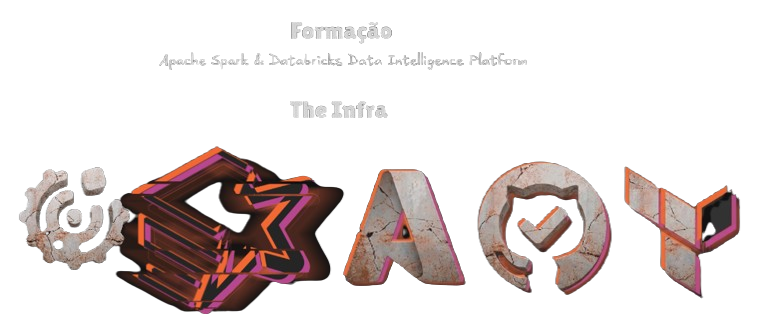

# Azure Databricks Enterprise Infrastructure



## 🎯 Project Goal

This project is designed to guide students and engineers through the practical implementation of a **Production-Ready Databricks Data Platform** on Azure.

We go beyond simple "Hello World" examples to cover real-world requirements:
*   **Environment Separation:** Distinct Dev, Prod and Governance environments.
*   **Governance:** Full Unity Catalog implementation with centralized Metastore.
*   **Security:** VNet Injection, Databricks Connector and Service Principals.
*   **Automation:** From local "ClickOps" to fully automated CI/CD pipelines.

### 🎓 Learning Path
The project is structured sequentially to build your skills step-by-step:

1.  **Phase 1: Local State (The Mechanics)**
    *   You will deploy infrastructure from your local machine.
    *   **Goal:** Understand *what* resources are being created and *how* Terraform interacts with Azure/Databricks without the complexity of pipelines.

2.  **Phase 2: CI/CD (The Professional Way)**
    *   You will refactor the code to use Remote State and GitHub Actions.
    *   **Goal:** Learn how to manage infrastructure in a team setting, enforce code reviews, and automate deployments using Service Principals.

---

## 🛠️ Technical Prerequisites

To run this project, you need the following tools installed on your machine:

*   **[Azure CLI](https://docs.microsoft.com/en-us/cli/azure/install-azure-cli):** For authentication and managing Azure resources.
*   **[Terraform](https://www.terraform.io/downloads):** (v1.5+) Infrastructure as Code tool.
*   **[Git](https://git-scm.com/downloads):** Version control.

> **Note:** This project was developed and tested on **Ubuntu 24.04 LTS**.
> *   If you are on **Windows**, we highly recommend using **WSL2** (Windows Subsystem for Linux) with Ubuntu.
> *   If you are on **macOS**, the commands are similar (use `brew` instead of `apt`), but the scripts are Bash-based and should run natively.

---

## ⚙️ Mandatory Configuration

Before running any code, you **must** have a valid Azure Subscription and a Databricks Account.

👉 **[Read the Azure & Databricks Initial Setup Guide](./documents_utils/deploy_utils/AZURE_START_GUIDE.md)**

*   *This guide covers creating your account, registering resource providers, and retrieving the critical Account ID.*

---

## 📂 Project Structure

Here is the high-level structure of the codebase:

```text
devops-dataops-project/
├── .github/
│   └── workflows/               # CI/CD Pipelines (GitHub Actions)
├── terraform-infra-localstate/  # [Learning Phase] Local state implementation
│   ├── phase-01-azure-infra/    # Physical Infrastructure (VNets, Storage, Workspaces)
│   ├── phase-02-unity-catalog/  # Logical Governance (Metastore, Catalogs, Grants)
│   └── scripts/                 # Helper scripts for deployment
├── terraform-infra-cicd/        # [Enterprise Phase] Remote state & Automation
│   ├── phase-00-bootstrap/      # Terraform Backend setup (Storage for State)
│   ├── phase-01-azure-infra/    # Infra with Remote State
│   └── phase-02-unity-catalog/  # Config with Remote State & Enhanced Security
└── documents_utils/             # Documentation, Images, and Guides
```

### 🏗️ Complete Architecture Diagram

This diagram illustrates the full **Enterprise Architecture** we will build, including the separation of duties, networking, and Unity Catalog governance.

```text
                                  AZURE TENANT
                                       │
  ┌────────────────────────────────────┴────────────────────────────────────┐
  │                        SUBSCRIPTION: UberEats-DataOps                   │
  │                                                                         │
  │  ┌─────────────────────────┐   ┌─────────────────────────────────────┐  │
  │  │ RG: Governance (Shared) │   │ RG: Bootstrap (Terraform State)     │  │
  │  │                         │   │                                     │  │
  │  │ • ADLS Gen2 (Metastore) │   │ • Storage Account (tfstate)         │  │
  │  │ • Access Connector      │   │   └─ container: tfstate             │  │
  │  │   (Managed Identity)    │   │                                     │  │
  │  └────────────┬────────────┘   └─────────────────────────────────────┘  │
  │               │                                                         │
  │               ▼ (Unity Catalog Metastore)                               │
  │                                                                         │
  │  ┌─────────────────────────┐   ┌─────────────────────────────────────┐  │
  │  │ RG: Development (Dev)   │   │ RG: Production (Prod)               │  │
  │  │                         │   │                                     │  │
  │  │ ┌─ VNet: dev-vnet ────┐ │   │ ┌─ VNet: prod-vnet ───┐             │  │
  │  │ │ Subnets:            │ │   │ │ Subnets:            │             │  │
  │  │ │ • public (host)     │ │   │ │ • public (host)     │             │  │
  │  │ │ • private (container│ │   │ │ • private (container│             │  │
  │  │ │   + NSG             │ │   │ │   + NSG             │             │  │
  │  │ └─────────┬───────────┘ │   │ └─────────┬───────────┘             │  │
  │  │           │             │   │           │                         │  │
  │  │ ┌─────────▼───────────┐ │   │ ┌─────────▼───────────┐             │  │
  │  │ │ Databricks Workspace│ │   │ │ Databricks Workspace│             │  │
  │  │ │      (DEV)          │ │   │ │      (PROD)         │             │  │
  │  │ └─────────┬───────────┘ │   │ └─────────┬───────────┘             │  │
  │  │           │             │   │           │                         │  │
  │  │ ┌─────────▼───────────┐ │   │ ┌─────────▼───────────┐             │  │
  │  │ │ ADLS Gen2 (Data)    │ │   │ │ ADLS Gen2 (Data)    │             │  │
  │  │ │ Containers:         │ │   │ │ Containers:         │             │  │
  │  │ │ • landing           │ │   │ │ • landing           │             │  │
  │  │ │ • bronze            │ │   │ │ • bronze            │             │  │
  │  │ │ • silver            │ │   │ │ • silver            │             │  │
  │  │ │ • gold              │ │   │ │ • gold              │             │  │
  │  │ └─────────────────────┘ │   │ └─────────────────────┘             │  │
  │  └─────────────────────────┘   └─────────────────────────────────────┘  │
  └─────────────────────────────────────────────────────────────────────────┘

                 UNITY CATALOG (Logical Layer)
  ┌─────────────────────────────────────────────────────────────────────────┐
  │  • Metastore (Global)                                                   │
  │  • Storage Credential (wraps Access Connector)                          │
  │  • External Locations (points to ADLS Containers)                       │
  │  • Catalogs:                                                            │
  │     ├─ ubereats_dev  (Managed by Data Engineers)                        │
  │     └─ ubereats_prod (Read-Only / Pipeline Access)                      │
  └─────────────────────────────────────────────────────────────────────────┘
```

---

## 🚀 Start Your Journey

Choose your path below. Learning will be most effective if you follow the phases in order.

### 1️⃣ Start Here: Local State Guide
👉 **[Go to Terraform Local State README](./terraform-infra-localstate/README.md)**

### 2️⃣ Advanced: CI/CD Automation
👉 **[Go to Terraform CI/CD README](./terraform-infra-cicd/README.md)**

> **⚠️ Important Note on GitHub Environments:**
> This project uses **GitHub Environments** (for approval gates) which are free for **Public Repositories**.
> *   **If you keep your repo Public:** Be extremely careful with your secrets! Never commit keys to code. Use GitHub Secrets as instructed.
> *   **If you make your repo Private:** You might need to disable the "Environment" protection rules in the workflow files or upgrade to GitHub Pro/Team, as Environments are a paid feature for private repos.
> *   **Educational Choice:** I chose to keep this open to demonstrate the full "Production" approval flow.

---

## Acknowledgments

Special thanks to all the students, my colleagues, my mentors, and a special shoutout to everyone at Engenharia de Dados Academy, who taught me how to become a solid Data Engineer.

> *"To play a wrong note is insignificant; to play without passion is inexcusable."*
> — **Ludwig van Beethoven**